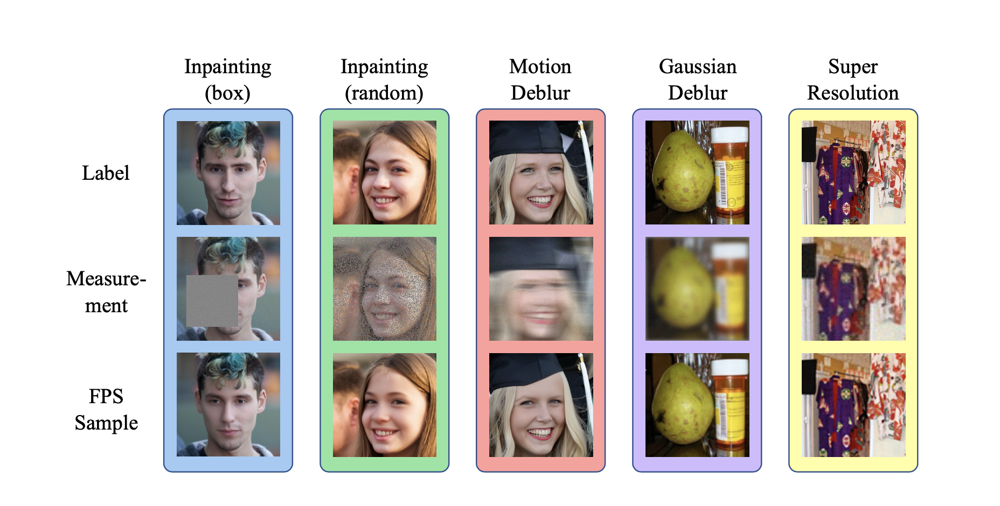

# Diffusion Posterior Sampling for Linear Inverse Problem Solving: A Filtering Perspective


## Abstract
Diffusion models have achieved tremendous success in generating high-dimensional data like images, videos and audio. These models provide powerful data priors that can solve linear inverse problems in zero shot through Bayesian posterior sampling.
However, exact posterior sampling for diffusion models is intractable. Current solutions often hinge on approximations that are either computationally expensive or lack strong theoretical guarantees. In this work, we introduce an efficient diffusion sampling algorithm for linear inverse problems that is guaranteed to be asymptotically accurate. We reveal a link between Bayesian posterior sampling and Bayesian filtering in diffusion models, proving the former as a specific instance of the latter. Our method, termed filtering posterior sampling, leverages sequential Monte Carlo methods to solve the corresponding filtering problem. It seamlessly integrates with all Markovian diffusion samplers, requires no model re-training, and guarantees accurate samples from the Bayesian posterior as particle counts rise. Empirical tests demonstrate that our method generates better or comparable results than leading zero-shot diffusion posterior samplers on tasks like image inpainting, super-resolution, and motion deblur.




## Prerequisites
- python 3.8

- pytorch 1.11.0

- CUDA 11.3.1

It is okay to use lower version of CUDA and pytorch as long as they are compatible, (such as CUDA 10.2 and pytorch 1.7.0)

<br />

## Getting started 

### 1) Clone the repository

```
git clone https://github.com/ZehaoDou-official/FPS-SMC-2023

cd FPS-SMC-2023
```

<br />

### 2) Download pretrained checkpoint
From the [link](https://drive.google.com/drive/folders/1jElnRoFv7b31fG0v6pTSQkelbSX3xGZh?usp=sharing), download the checkpoint "ffhq_10m.pt" and paste it to ./models/
```
mkdir models
mv {DOWNLOAD_DIR}/ffqh_10m.pt ./models/
```
{DOWNLOAD_DIR} is the directory that you downloaded checkpoint to.

:speaker: Checkpoint for imagenet is uploaded.

<br />


### 3) Set environment
### Local environment setting

We use the external codes for motion-blurring and non-linear deblurring.

```
git clone https://github.com/VinAIResearch/blur-kernel-space-exploring bkse

git clone https://github.com/LeviBorodenko/motionblur motionblur
```

Install dependencies

```
conda create -n DPS python=3.8

conda activate DPS

pip install -r requirements.txt

pip install torch==1.11.0+cu113 torchvision==0.12.0+cu113 torchaudio==0.11.0 --extra-index-url https://download.pytorch.org/whl/cu113
```

<br />

### 4) Inference

```
python3 sample_condition.py \
--model_config=configs/model_config.yaml \
--diffusion_config=configs/diffusion_config.yaml \
--task_config={TASK-CONFIG};
```
<br />

## Possible task configurations

```
# Linear inverse problems
- configs/super_resolution_config.yaml
- configs/gaussian_deblur_config.yaml
- configs/motion_deblur_config.yaml
- configs/inpainting_config.yaml

# Non-linear inverse problems
- configs/nonlinear_deblur_config.yaml
- configs/phase_retrieval_config.yaml
```

### Structure of task configurations
You need to write your data directory at data.root. Default is ./data/samples which contains three sample images from FFHQ validation set.

```
conditioning:
    method: # check candidates in guided_diffusion/condition_methods.py
    params:
        scale: 0.5

data:
    name: ffhq
    root: ./data/samples/

measurement:
    operator:
        name: # check candidates in guided_diffusion/measurements.py

noise:
    name:   # gaussian or poisson
    sigma:  # if you use name: gaussian, set this.
    (rate:) # if you use name: poisson, set this.
```

